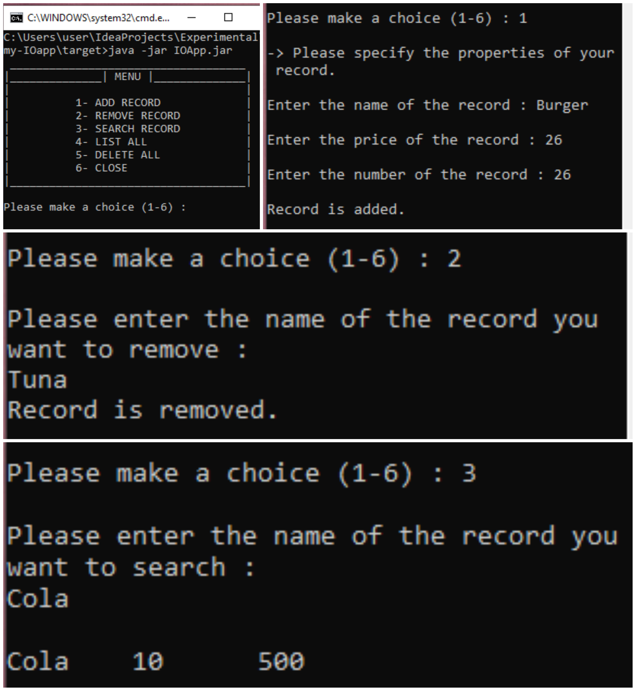
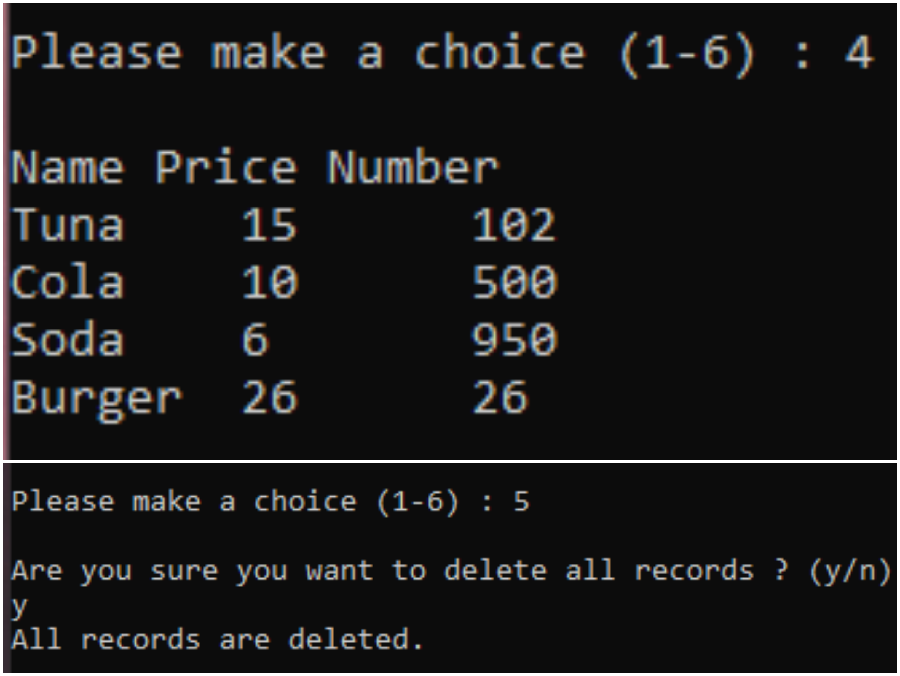

# IOapp
 CLI app for record adding, removing, searching and listing.

### Running

* Create executable for project.
```
mvn package
```
* IOApp.jar under target is executable form of project.

```
java -jar IOApp.jar
```

## Screenshots





## Built With

* [Maven](https://maven.apache.org/)

## License

This project is licensed under the MIT License - see the [LICENSE.md](LICENSE.md) file for details